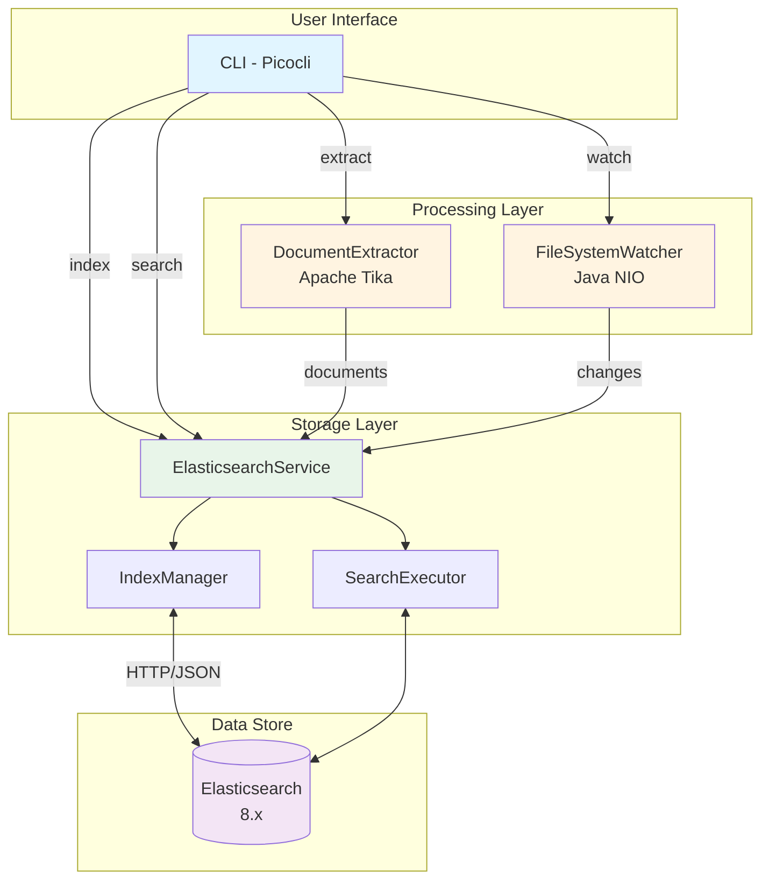

# System Architecture

## Component Description

### User Interface Layer
- **CLI (Picocli)**: Command-line interface providing six main commands:
  - `create-index`: Initialize Elasticsearch index
  - `update-index`: Bulk index documents
  - `search`: Query indexed documents
  - `stats`: Display index statistics
  - `reindex`: Recreate index from scratch
  - `watch`: Monitor filesystem changes

### Processing Layer
- **DocumentExtractor**: Extracts text content and metadata using Apache Tika
- **FileSystemWatcher**: Monitors directories for CREATE/MODIFY/DELETE events

### Storage Layer
- **ElasticsearchService**: Main service coordinating all ES operations
- **IndexManager**: Handles index creation, deletion, mappings
- **SearchExecutor**: Executes queries and retrieves statistics

### Data Store
- **Elasticsearch**: Distributed search engine storing inverted index
