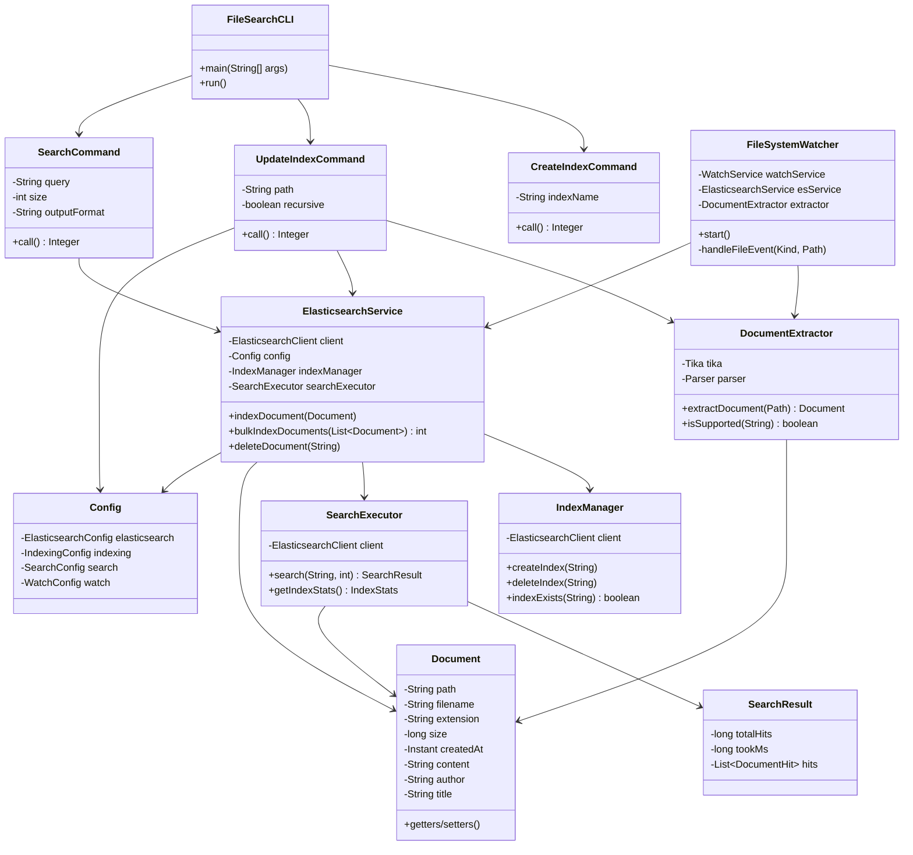

# Class Diagram

## Class Responsibilities

### CLI Layer
- **FileSearchCLI**: Entry point, routes to subcommands
- **CreateIndexCommand**, **UpdateIndexCommand**, **SearchCommand**: Command implementations

### Model Layer
- **Document**: POJO representing indexed file with metadata
- **SearchResult**: Search query results with hits and scores
- **Config**: Configuration loaded from YAML

### Processing Layer
- **DocumentExtractor**: Tika integration for content extraction
- **FileSystemWatcher**: Monitors filesystem changes with Java NIO

### Storage Layer
- **ElasticsearchService**: Main service facade
- **IndexManager**: Index lifecycle management
- **SearchExecutor**: Query execution and statistics
