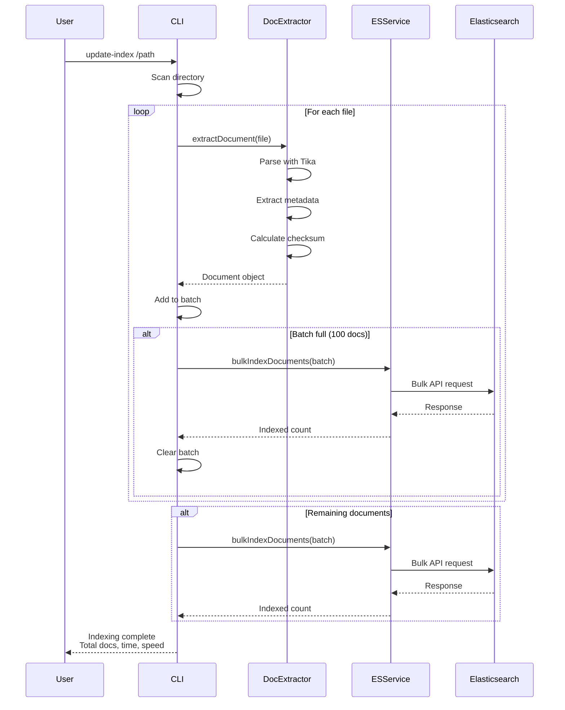

# Indexing Flow Diagram

## Flow Description

1. **Directory Scanning**: CLI recursively scans the target directory
2. **File Filtering**: Checks extension whitelist and size limits
3. **Document Extraction**: Tika parses file and extracts content + metadata
4. **Batch Accumulation**: Documents accumulated until batch size (100) reached
5. **Bulk Indexing**: Batch sent to Elasticsearch via Bulk API
6. **Progress Reporting**: User receives real-time progress updates
7. **Final Statistics**: Total documents, duration, and throughput reported
