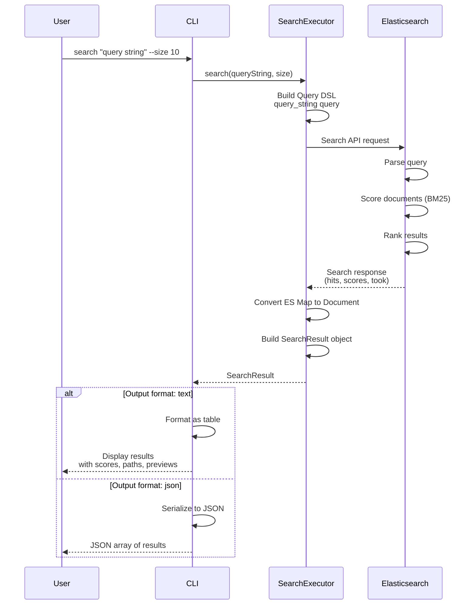

# Search Flow Diagram

## Flow Description

1. **Query Input**: User provides search query using query_string syntax
2. **Query Building**: SearchExecutor constructs ES Query DSL
3. **Search Execution**: Query sent to Elasticsearch _search endpoint
4. **Scoring**: ES applies BM25 ranking algorithm
5. **Response Processing**: SearchExecutor converts raw response to typed objects
6. **Output Formatting**: CLI formats results based on user preference (text/JSON)
7. **Result Display**: User sees ranked results with relevance scores
